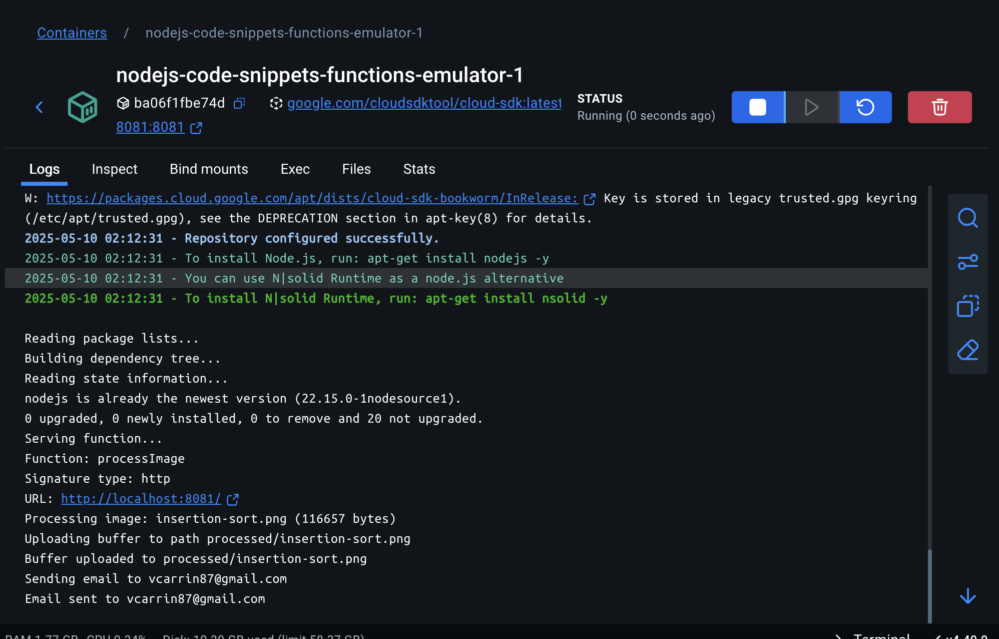

# NodeJS-Code-Snippets
Code examples using NodeJS

## Cloud Storage
Cloud Storage allows you to store and retrieve files in a scalable and secure manner. It is commonly used for storing media assets, backups, and other large datasets.

### Example Use Case:
To view the contents of a cloud storage bucket in your browser, you can use the following endpoint:
```
http://localhost:4443/storage/v1/b/<bucket-name>/o
```
Replace `<bucket-name>` with the name of your storage bucket to access its contents.

<details>
<summary>Endpoints</summary>

#### 1. Uploads a file
**Endpoint:** `POST /cloud-storage/upload`  
**Description:** Uploads a file as a buffer and sends it to Cloud Tasks. \
**Middleware**: `upload.single('file')` (expects a file field named `file` in the request)

### Request Body
- **file**: The file to be uploaded (binary data).

#### 2. Process image
**Endpoint:** `POST /cloud-tasks/process-image`  
**Description:**  Process an image from a Cloud Task and upload to Cloud Storage bucket `media_assets`.

**Request Body:**
- `fileName` (required): File name to be uploaded.
- `base64Image` (required): The base64-encoded string representation of the image.
- `user` (required): The logged in user
```json
{
    "fileName": "string",
    "base64Image": "string",
    "user": {
        "full_name": "string",
        "email": "string"
    }
}
```

#### 3. Rename a folder in Google Cloud Storage media_assets bucket.
**Endpoint:** `POST /cloud-storage/copyFileToNewPath` \
**Description:** This endpoint is responsible for copying a file from its current location to a new specified path.

**Request Body:**
```json
{
    "oldPath": "string",
    "newPath": "string"
}
```

</details>


## Pub/Sub
Pub/Sub (short for Publish/Subscribe) is a messaging pattern used in distributed systems to enable asynchronous communication between components. It decouples the producers (publishers) of messages from the consumers (subscribers), allowing them to operate independently.

Key Concepts: \
**Publisher**: The component that sends messages (events) to a topic. Publishers don't need to know who will consume the messages. \
**Subscriber**: The component that listens for messages from a topic. Subscribers don't need to know who published the messages. \
**Topic**: A named channel where messages are sent by publishers and received by subscribers.

<details>
<summary>Endpoints</summary>

#### 1. Publish a Message
**Endpoint:** `POST /pub-sub/publish-message`  
**Description:** Publishes a message to a specified topic.  

**Request Body:**
```json
{
    "topicName": "string",
    "data": "string"
}
```

#### 2. Subscribe to a Topic
**Endpoint:** `POST /pub-sub/subscribe`  
**Description:** Subscribes to a topic with a given subscription name.  

**Request Body:**
```json
{
    "topicName": "string",
    "subscriptionName": "string"
}
```

#### 3. List All Topics
**Endpoint:** `GET /pub-sub/list-topics`  
**Description:** Retrieves a list of all topics.  

#### 4. Create a Topic
**Endpoint:** `POST /pub-sub/create-topic`  
**Description:** Creates a new topic.  
**Query Parameters:**
- `topicName` (required): The name of the topic to create.

#### 5. Create a Subscription
**Endpoint:** `POST /pub-sub/create-subscription`  
**Description:** Creates a subscription for a specified topic.  
**Query Parameters:**
- `topicName` (required): The name of the topic.
- `subscriptionName` (required): The name of the subscription.

</details>

## Cloud Tasks
Cloud Tasks is a fully managed service that allows you to asynchronously execute tasks in the background. It is commonly used for decoupling heavy or time-consuming operations from the main application flow.

<details>
<summary>Endpoints</summary>

#### 1. List Tasks
**Endpoint:** `GET /cloud-tasks/list-cloud-tasks`  
**Description:** Retrieves a list of all tasks in a specified queue.  
**Request Body:**
- `queueName` (required): The name of the queue.
- `location` (required): The name of the location.
```json
{
    "queueName": "string",
    "location": "string"
}
```

#### 2. Delete a Task
**Endpoint:** `DELETE /cloud-tasks/delete-task`  
**Description:** Deletes a task from a specified queue.  
**Request Body:**
- `taskName` (required): The name of the task to delete.
- `queueName` (required): The name of the queue.
- `location` (required): The name of the location.
```json
{
    "taskName": "string",
    "queueName": "string",
    "location": "string"
}
```

</details>

## Cloud Functions

Google Cloud Functions is a serverless compute service provided by Google Cloud Platform (GCP).

#### How It Works
1. **Write the Function:** Write your function in a supported language (e.g., Node.js, Python, Go).
2. **Deploy the Function:** Deploy the function to GCP using the gcloud CLI or the GCP Console.
3. **Trigger the Function:** Specify the event source that will trigger the function (e.g., HTTP request, Pub/Sub message, or Cloud Storage event).
4. **Execute and Scale:** When the event occurs, the function is executed, and GCP automatically scales resources as needed.

**Path:** /google-cloud-provider/cloud-functions/process-image \
**Function name:** processImage \
    - the function is designed to process an image and upload it to a Cloud Storage bucket (media_assets) \
    - when we upload an image (http://localhost:3000/cloud-storage/upload), we send the image to cloud tasks \
    - the cloud task posts the image to cloud function endpoint to process the image \
    - the cloud task also posts the logged in user to cloud function and sends a completion status email \
    - this reduces the overload on the service and allows for function to scale up to meed the demand and scale down when the process completes



